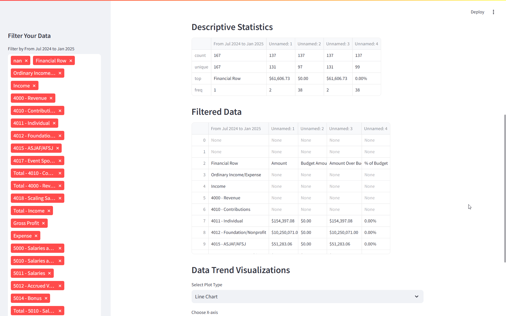
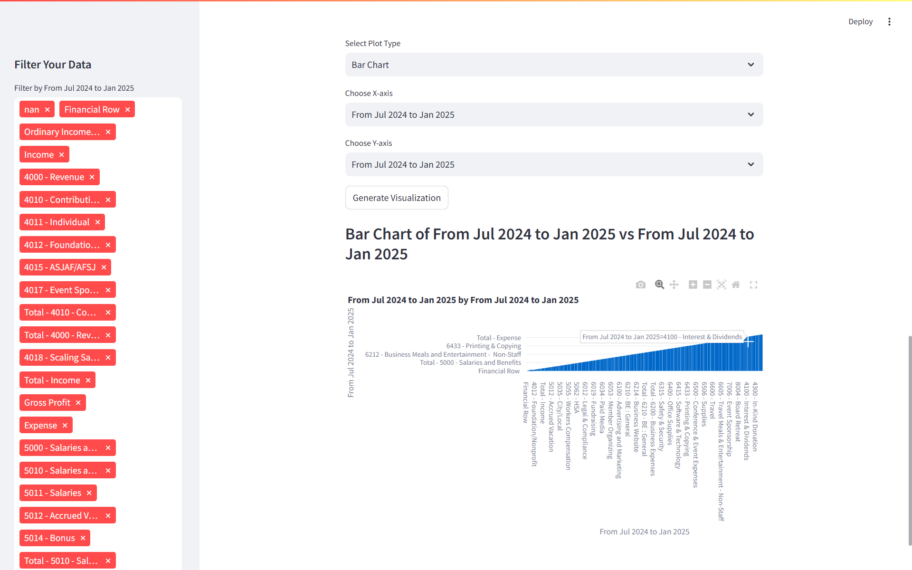
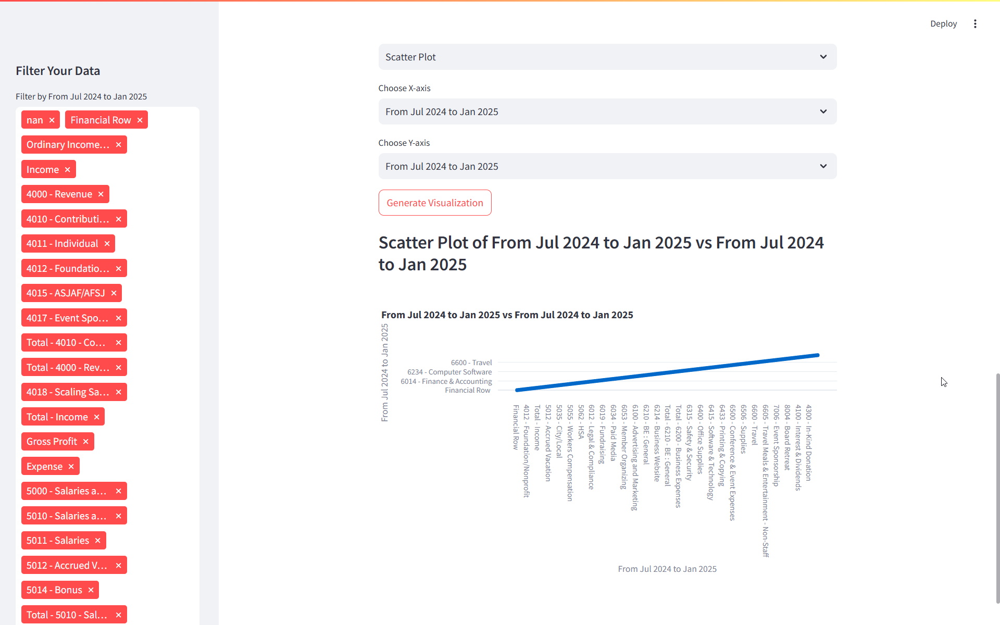

# Interactive Data Analyzer App

## 🚀 Live Demo
[Click here to access the live app](https://interactive-data-analyzer.streamlit.app/)

## 📸 App Screenshots

### 1️⃣ Upload CSV File


### 2️⃣ Raw Data Preview


### 3️⃣ Data Filtering Options


### 4️⃣ Visualization Dashboard


## 📜 About the Project
The **Interactive Data Analyzer** is a web-based tool built using **Streamlit**, allowing users to upload CSV files, filter datasets, and generate visualizations with ease. This app empowers users to explore data trends efficiently.

## ✨ Features
- 📂 **CSV File Upload**: Upload and analyze CSV files.
- 🔍 **Data Preview**: View raw data and descriptive statistics.
- 🛠 **Data Filtering**: Apply categorical and numerical filters.
- 📊 **Interactive Visualizations**: Choose from Line Charts, Bar Charts, Scatter Plots, and Pie Charts.

## 🛠 Tech Stack
- **Python** 🐍
- **Streamlit** 🌐
- **Pandas** 📊
- **Plotly Express** 📈
- **Matplotlib** 🎨

## 🏗️ How to Run Locally
1. **Clone the Repository**
```bash
git clone https://github.com/zohaib-javd/interactive-data-analyzer.git
cd interactive-data-analyzer
```
2. **Create Virtual Environment & Install Dependencies**
```bash
python -m venv env
source env/bin/activate  # For Mac/Linux
env\Scripts\activate    # For Windows
pip install -r requirements.txt
```
3. **Run the Streamlit App**
```bash
streamlit run app.py
```

## 💬 Connect with me:

🔗 [LinkedIn](https://www.linkedin.com/in/zohaib-javd)  
👨‍💻 [GitHub](https://www.github.com/zohaib-javd)  
📧 [Email](mailto:zohaibjaved@gmail.com)  
❎ [X](https://x.com/zohaibjaved)  
📺 [YouTube](https://www.youtube.com/@Zohaib-Javed)  

---
📌 *Feel free to fork the repository and contribute!* 🎯

